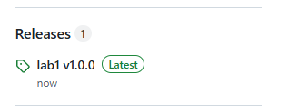
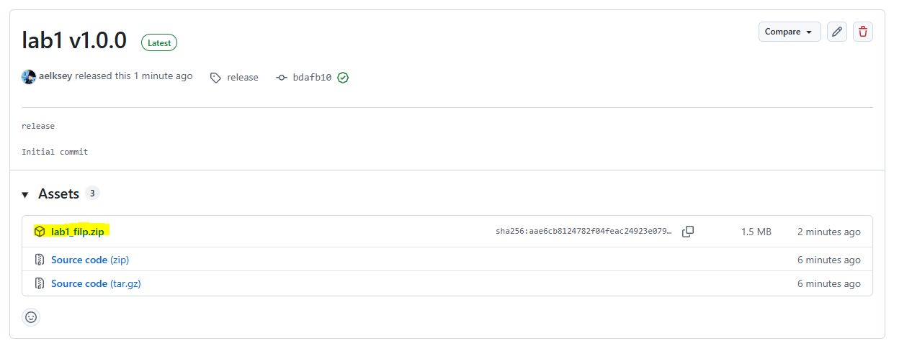

# FiLPLabs

Лабораторные работы по ФиЛП

---

**Как скачать?**

1. Найти Releases (справа)

2. Нажать, откроется окно:

3. Нажать по ```lab*_filp.zip``` где ```*``` номер лабы, начнётся **загрузка** 
